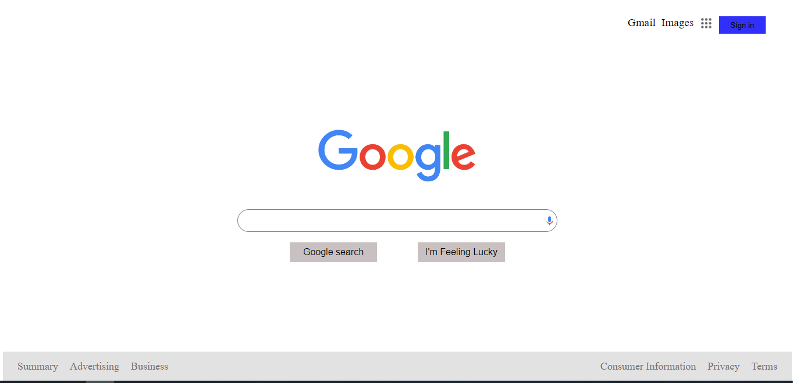
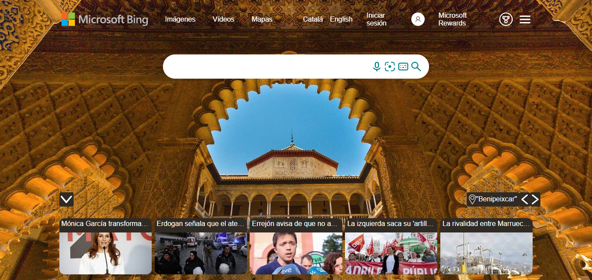
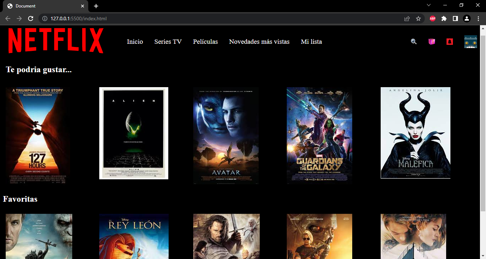

# Ejercicios de HTML Y CSS DEL DIA 07-11-2022

Tenemos que hacer los layout de GOOGLE, BING Y NETFLIX.

### Herramientas que hemos utilizado para hacer esta tarea:
* Visual studio code
* Github

### Ejemplo de los layout

